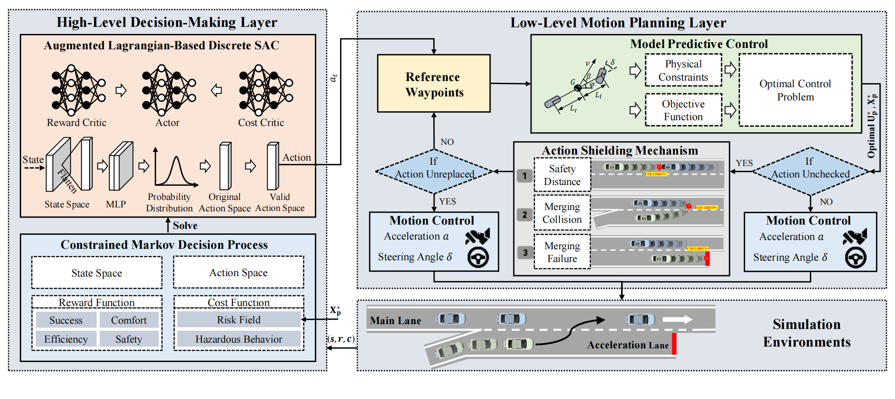
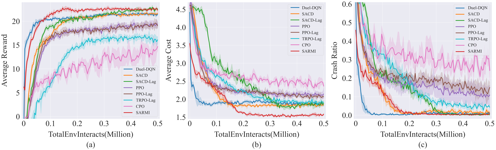

# SARMI: Risk-Constrained On-Ramp Merging via Safety-Augmented RL and MPC

<p align="center">
  <b>Safe, Risk-Aware, and Interpretable Reinforcement Learning for Autonomous On-Ramp Merging</b>
</p>

<p align="center">
  <a href="https://doi.org/10.1109/JIOT.2026.3676898">
    
  </a>
  <a href="https://doi.org/10.1109/JIOT.2026.3676898">
    
  </a>
  
  
  
</p>

---

## 📢 News

* **2026:** Our paper **"Risk-Constrained On-Ramp Merging via Safety-Augmented Reinforcement Learning and Model Predictive Control"** was published in *IEEE Internet of Things Journal*.
* **2026:** The official implementation of **SARMI** is released in this repository.

---

## 📖 Introduction

Autonomous on-ramp merging is a challenging decision-making problem because an autonomous vehicle must simultaneously achieve **safety, efficiency, interaction awareness, and real-time decision making** in highly dynamic traffic environments.

Pure reinforcement learning methods can learn complex interactive driving behaviors, but they may violate safety constraints during exploration or execution. In contrast, model predictive control provides strong short-horizon predictive capability and explicit constraint handling, but its performance may be limited when handling complex and uncertain multi-vehicle interactions.

**SARMI** addresses these challenges by integrating **Safety-Augmented Reinforcement Learning (RL)** with **Model Predictive Control (MPC)** in a unified hierarchical framework.

The proposed framework enables the autonomous vehicle to:

* learn efficient merging strategies through reinforcement learning;
* explicitly consider safety constraints during policy optimization;
* anticipate future collision risks using MPC-based state prediction;
* eliminate infeasible decisions through action masking;
* correct potentially unsafe decisions through action shielding;
* balance **safety, merging efficiency, and driving performance** in interactive highway scenarios.

<p align="center">
  <b>SARMI = Safety-Augmented RL + Predictive Risk Assessment + MPC + Dual Safety Protection</b>
</p>

---

## 🏗️ Framework

<p align="center">
  
</p>

<p align="center">
  <i>Overall architecture of the proposed SARMI framework.</i>
</p>


The SARMI framework consists of four major components:

1. **Safety-Augmented Reinforcement Learning**
   A SAC-Discrete agent learns high-level interactive merging strategies under explicit safety constraints.

2. **MPC-Based Future State Prediction**
   MPC predicts future traffic states to support proactive risk assessment.

3. **Gaussian Risk Field Modeling**
   Future collision risks are quantified and incorporated into the decision-making objective.

4. **Dual Safety Protection**
   Action masking removes infeasible actions during exploration, while action shielding replaces unsafe actions during execution.

---

## ✨ Highlights

### 🧠 1. Safety-Augmented Reinforcement Learning

SARMI employs a **SAC-Discrete** reinforcement learning architecture enhanced with an **Augmented Lagrangian-based safety optimization mechanism**.

Barrier-like quadratic penalty terms are introduced into the constrained optimization process to improve constraint satisfaction while reducing undesirable oscillations during policy optimization.

This allows the RL agent to optimize driving performance while explicitly accounting for safety requirements.

---

### 🔮 2. Predictive Risk Assessment with MPC

Instead of evaluating collision risk only from the current traffic state, SARMI uses **MPC-predicted future vehicle states** to estimate prospective interaction risks.

A **Gaussian-based risk field** is incorporated into the decision-making cost formulation, enabling the agent to assess potential collisions before dangerous interactions actually occur.

This allows SARMI to make **proactive rather than purely reactive safety decisions**.

---

### 🛡️ 3. Dual Safety Mechanism

SARMI introduces two complementary safety layers.

#### Action Masking

Invalid or infeasible actions are removed from the action space during policy exploration, preventing the RL agent from repeatedly exploring obviously unsafe decisions.

#### Action Shielding

During policy execution, potentially unsafe actions generated by the RL policy can be intercepted and replaced with safer alternatives.

Together, these mechanisms improve both **training safety** and **deployment-time reliability**.

---

### 🚗 4. Hierarchical RL-MPC Integration

The proposed framework combines the advantages of learning-based and model-based decision making.

| Component              | Function                                                                    |
| ---------------------- | --------------------------------------------------------------------------- |
| Reinforcement Learning | Learns high-level interactive merging strategies                            |
| MPC                    | Predicts future vehicle states and supports short-horizon safety evaluation |
| Gaussian Risk Field    | Quantifies prospective collision risks                                      |
| Action Masking         | Removes invalid actions during exploration                                  |
| Action Shielding       | Corrects unsafe actions during execution                                    |
| Augmented Lagrangian   | Handles safety-constrained policy optimization                              |

This architecture provides a practical balance between **learning capability, predictive safety, interpretability, and real-time control**.

---

### 📐 5. Theoretical Analysis

In addition to the algorithmic design, the paper provides theoretical analysis of the proposed constrained optimization framework.

The analysis establishes the relationship between the **primal and dual formulations** and proves the equivalence of their optimal solutions under the proposed framework.

---

## 📊 Performance

Experimental results demonstrate that SARMI improves both merging safety and driving performance in challenging on-ramp scenarios.

Compared with **MAPPO-Lag**, SARMI achieves approximately:

* **+6.9%** improvement in successful merging rate;
* **−33.4%** reduction in collision rate.

These results indicate that predictive risk assessment and the proposed safety-augmentation mechanisms significantly improve the reliability of learning-based autonomous merging.

<p align="center">
  
</p>

<p align="center">
  <i>Example quantitative comparison of SARMI with baseline methods.</i>
</p>


For complete experimental settings, ablation studies, baseline comparisons, and statistical results, please refer to the published paper.

---

## 🎥 Simulation Video

Simulation demonstrations and visualization results are available at:

👉 **https://github.com/JianLi000/Visualization**


---

## 📂 Repository Structure

A typical repository structure is shown below:

```text
SARMI/
├── assets/               # Framework figures, result figures, and demo GIFs
├── config/               # Training and evaluation configurations
├── env/                  # On-ramp merging simulation environment
├── models/               # RL and MPC models
├── scripts/              # Training and evaluation scripts
├── utils/                # Utility functions
├── train.py              # Training entry point
├── evaluate.py           # Evaluation entry point
├── requirements.txt      # Python dependencies
└── README.md
```

> Please update this section according to the actual structure of your repository.

---

## ⚙️ Installation

### 1. Clone the repository

```bash
git clone https://github.com/Yangli0505/SARMI.git
cd SARMI
```

### 2. Create a Python environment

Using Conda is recommended:

```bash
conda create -n sarmi python=3.10
conda activate sarmi
```

### 3. Install dependencies

```bash
pip install -r requirements.txt
```

> Please modify the Python version and dependencies according to your actual implementation.

---

## 🚀 Training

To train the SARMI agent, run:

```bash
python train.py
```

If configuration files are used, you may organize the command as:

```bash
python train.py --config config/sarmi.yaml
```

For multiple random seeds:

```bash
python train.py --config config/sarmi.yaml --seed 0
python train.py --config config/sarmi.yaml --seed 1
python train.py --config config/sarmi.yaml --seed 2
python train.py --config config/sarmi.yaml --seed 3
```

> Update the commands according to your actual scripts and arguments.

---

## 🧪 Evaluation

To evaluate a trained SARMI policy:

```bash
python evaluate.py
```

For example:

```bash
python evaluate.py \
  --model checkpoints/sarmi_best.pth \
  --config config/sarmi.yaml
```

Typical evaluation metrics include:

* merging success rate;
* collision rate;
* average travel time;
* driving efficiency;
* safety constraint violations;
* accumulated reward.

---

## 📦 Pretrained Models

Pretrained models can be provided under:

```text
checkpoints/
```

Example:

```text
checkpoints/
├── sarmi_seed0.pth
├── sarmi_seed1.pth
├── sarmi_seed2.pth
└── sarmi_seed3.pth
```

If pretrained checkpoints are released separately, please provide the download link here.

---

## 🔁 Reproducing the Paper Results

To facilitate reproducibility, we recommend following the pipeline below:

```text
1. Install the required environment
2. Configure the on-ramp merging scenario
3. Train SARMI using multiple random seeds
4. Evaluate each trained policy
5. Compute success rate, collision rate, and efficiency metrics
6. Compare SARMI with baseline methods
```

A typical workflow is:

```bash
# Train
python train.py --config config/sarmi.yaml --seed 0

# Evaluate
python evaluate.py \
  --model checkpoints/sarmi_seed0.pth \
  --config config/sarmi.yaml
```

For a fair comparison, all baseline methods should be evaluated under the same traffic scenarios, random seeds, and evaluation metrics.

---

## 🔬 Research Topics

This repository may be useful for researchers working on:

* Autonomous Driving
* Intelligent Vehicles
* Connected and Automated Vehicles
* Safe Reinforcement Learning
* Constrained Reinforcement Learning
* Reinforcement Learning for Autonomous Driving
* Model Predictive Control
* Highway On-Ramp Merging
* Interactive Decision Making
* Risk-Aware Decision Making
* Motion Planning
* Safety-Critical Control
* RL-MPC Integration

---

## 📄 Paper

### Risk-Constrained On-Ramp Merging via Safety-Augmented Reinforcement Learning and Model Predictive Control

**Yang Li, Jian Li, Wenjie Huang, Qisong Yang, Hongmao Qin, Xiaolong Jiang, Yougang Bian, Manjiang Hu, and Yingbai Hu**

*IEEE Internet of Things Journal*,
Vol. 13, No. 13, pp. 28121–28137, 2026.

**DOI:**
https://doi.org/10.1109/JIOT.2026.3676898

---

## 📝 Citation

If you find **SARMI** useful in your research, please consider citing our paper and giving this repository a ⭐.

```bibtex
@ARTICLE{11454581,
  author  = {Li, Yang and Li, Jian and Huang, Wenjie and Yang, Qisong and
             Qin, Hongmao and Jiang, Xiaolong and Bian, Yougang and
             Hu, Manjiang and Hu, Yingbai},
  journal = {IEEE Internet of Things Journal},
  title   = {Risk-Constrained On-Ramp Merging via Safety-Augmented
             Reinforcement Learning and Model Predictive Control},
  year    = {2026},
  volume  = {13},
  number  = {13},
  pages   = {28121--28137},
  doi     = {10.1109/JIOT.2026.3676898}
}
```

### Plain Text Citation

Yang Li, Jian Li, Wenjie Huang, Qisong Yang, Hongmao Qin, Xiaolong Jiang, Yougang Bian, Manjiang Hu, and Yingbai Hu,
"Risk-Constrained On-Ramp Merging via Safety-Augmented Reinforcement Learning and Model Predictive Control,"
*IEEE Internet of Things Journal*, vol. 13, no. 13, pp. 28121–28137, 2026.
doi: 10.1109/JIOT.2026.3676898.

---

## ⭐ Support This Project

If this repository is useful for your research, we would appreciate your support:

* ⭐ Star this repository to help others discover SARMI.
* 📄 Cite our paper if SARMI contributes to your research.
* 🔗 Share the repository with researchers working on safe autonomous driving.
* 💬 Open an Issue for questions, discussions, or reproducibility problems.
* 🤝 We welcome research discussions and potential collaborations.

---

## 📬 Contact

For questions, research discussions, or potential collaborations, please contact:

**Jian Li**
📧 [lijian000@hnu.edu.cn](mailto:lijian000@hnu.edu.cn)

**Yang Li**
📧 [lyxc56@gmail.com](mailto:lyxc56@gmail.com)

---

## 🙏 Acknowledgements

We sincerely thank the researchers and developers whose open-source projects, simulation tools, and previous studies contributed to the development and evaluation of this work.

---

<p align="center">
  <b>If you find SARMI useful, please consider giving this repository a ⭐ and citing our paper.</b>
</p>
